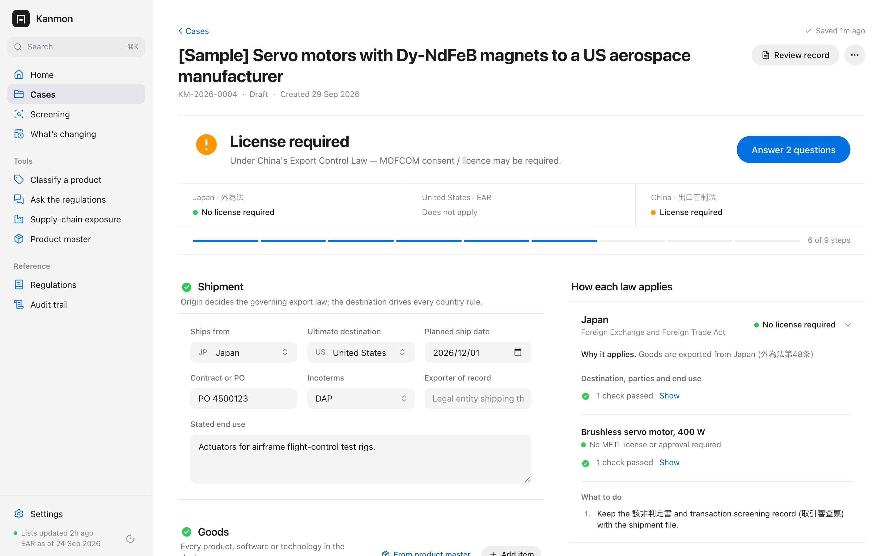
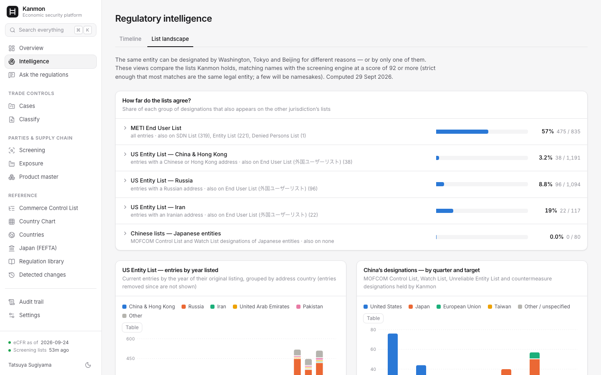

# Kanmon

**An economic-security workbench for export controls, restricted-party screening and supply-chain exposure — built for companies that trade across the US–Japan–China triangle.**

Kanmon (関門, *checkpoint*) assesses a transaction under every regime that reaches it — Japan's Foreign Exchange and Foreign Trade Act, the US Export Administration Regulations and China's Export Control Law — and shows, for each one, *why* it attaches, *what* it requires, and *which provision* says so. The regulation text is ingested from primary sources and versioned; the determination is computed by a deterministic rules engine; AI (Claude) drafts classifications and reads contracts, but never decides.



---

## Why this exists

A single shipment from Japan can be governed by three sovereigns at once:

| How a regime attaches | Example | What Kanmon evaluates |
|---|---|---|
| **Where the goods ship from** | Goods leave Japan → FEFTA applies | List control (輸出令別表第一), the 2025 catch-all tiers (16の項), the small-value exception, export approvals for Russia/Belarus and diversion countries |
| **What the goods are made of** | A Japanese product with a US-origin chip; a motor with Chinese dysprosium magnets | US de minimis and the Foreign Direct Product rules; China's commodity controls, end-user commitments and extraterritorial measures (2024 No. 46, 2026 No. 1, the suspended 0.1% rule) |
| **Who is on the other side** | A consignee on the Entity List, METI's End User List or MOFCOM's Control List | Part 744 end-user controls, OFAC exposure, the Japanese WMD/conventional end-user requirements, Chinese list effects |

Compliance teams usually hold this picture in their heads, across spreadsheets and PDFs, and the reasoning rarely survives into the record. Kanmon makes the jurisdictional nexus explicit, evaluates each regime from its own text, and keeps an auditable record of what was decided, by whom, and against which version of the rules.

It also treats **time** as an input. Several consequential rules are currently suspended with known end dates — the US Affiliates (50%) Rule re-applies on 2026-11-10 unless extended; China's October 2025 rare-earth package, including the extraterritorial 0.1% rule, is suspended until 2026-11-10 in law and until 2027-01-10 by political agreement. Kanmon evaluates each case on its ship date and tells you which open transactions a scheduled change would affect.

## Design principles

1. **The regulation text is the source of truth.** eCFR (15 CFR 730–774), e-Gov (輸出令, 貨物等省令, おそれ省令, 外為法), the trade.gov Consolidated Screening List, METI's End User List and MOFCOM's designation notices are fetched, parsed and stored as dated snapshots. Lists the engine needs — the UN arms-embargo countries, Russia HTS codes, MEU items, red flags, Japan's HS-designated catch-all goods — are *derived from the text*, not typed in.
2. **Deterministic where the law is deterministic; human judgment where it is not.** Country Chart lookups, de minimis arithmetic, catch-all tiering and list effects are computed. Classification, end-use knowledge and screening dispositions stay with a named reviewer. AI output is labelled provisional and verified against the dataset.
3. **Every conclusion cites its provision**, one click from the text it rests on, and every assessment records the data versions it used.
4. **"Incomplete" is an outcome.** Unanswered questions, unresolved red flags, pending screening matches and regulation text the engine does not recognise are surfaced for review — never silently guessed.
5. **Local-first.** Cases, documents and API keys stay on the machine running Kanmon. The only outbound traffic is to the public data sources and, if enabled, the Anthropic API.

## What it does

**Trade controls**
- **Case workspace** — transaction, items, parties and knowledge questions on the left; a live determination on the right that recomputes on every edit. Review workflow (submit / approve / reject) records the outcome and data versions with each decision.
- **United States (EAR)** — subject-to-the-EAR analysis (US origin, de minimis per §734.4 including the zero-threshold cases, a Foreign Direct Product questionnaire per §734.9 with Japan's partner-country exclusions), CCL × Commerce Country Chart at paragraph level, Part 746 embargoes and Russia/Belarus HTS lists, Part 744 end-user and end-use controls, and license-exception screening with the §740.2 restrictions.
- **Japan (FEFTA)** — list control with 項番, the catch-all as revised on 2025-10-09 (16の項（1）HS-designated goods vs （2）; WMD and conventional use / end-user requirements by destination tier; METI notifications for Group A; 明らかガイドライン ⑲), the small-value exception with the 別表第三の三 threshold, and export approvals (Russia/Belarus, 別表第二の四 diversion countries, occupied regions of Ukraine, North Korea).
- **China (ECL)** — ship-from licensing for Chinese subsidiaries, China-origin controlled materials (gallium, germanium, graphite, antimony, rare earths and magnets…), end-user commitments, the extraterritorial measures against Japanese and US military end use, and the effects of MOFCOM's Control List, Watch List, Unreliable Entity List and countermeasures.
- **Classification assistant** — retrieves candidate CCL entries and 貨物等省令 provisions, then has Claude compare each control parameter with the product's specifications, citing the paragraph for every threshold; ECCN and 項番 references are checked against the dataset.

**Parties & supply chain**
- **Restricted-party screening** — 27,000+ entries across 17 lists (BIS Entity List, MEU, UVL, Denied Persons; OFAC SDN and non-SDN lists; State Department lists; METI End User List; MOFCOM Control List, Watch List, UEL and countermeasures), with dispositions stored on the case, batch screening and a history log.
- **Supply-chain exposure** — which products and open transactions depend on China-origin controlled materials, and how that changes if suspended measures lapse.

**Intelligence**
- **Timeline** of dated regulatory events across jurisdictions, with the open cases each would affect.
- **Detected changes** — each data sync is diffed against the previous snapshot (Country Chart cells, Country Groups, ECCN requirements, Japanese country lists, list additions/removals).

**Reference & records**
- Browsers for the CCL, the Country Chart, country profiles, Japan's 別表第一 and catch-all, and the full EAR / Japanese-law library; **Ask the regulations**, a Q&A that answers only from retrieved provisions and cites them.
- A printable **Transaction Review Record** (取引審査票) with item classifications (該非判定), screening evidence, knowledge-question answers, findings with legal basis and a sign-off block.

## What the lists show

Because Kanmon holds the US, Japanese and Chinese lists side by side and matches names with the same engine, it can measure how far they agree (Intelligence → List landscape; name-match score ≥ 92, data as of 2026-09-29):

- **57%** of the 835 entities on METI's End User List also appear on a US list (319 on OFAC's SDN List, 221 on the Entity List).
- The reverse is far smaller: **3.2%** of Entity List entries with a Chinese or Hong Kong address, **8.8%** of Russian and **19%** of Iranian entries are on METI's list. Japan's list is built around weapons-of-mass-destruction and (since 2025) conventional-weapons end users; the Entity List also targets technology acquisition, surveillance and military modernization.
- **None** of the 80 Japanese entities MOFCOM placed on its Control List and Watch List in 2026 appears on a US or Japanese list — China's lists are a distinct instrument, and in 2026 they turned to Japan: 80 of the 97 designations made in the first half of the year target Japanese entities.

Name matching over-counts namesakes and under-counts transliteration variants, so these are indicative figures; the matched pairs can be inspected in the app.



## Quick start

Requirements: Node.js 20.19+.

```bash
git clone https://github.com/OSUGIYAMA/export-control-ai-assistant.git kanmon
cd kanmon
npm install
npm start            # builds the web app and serves it at http://localhost:8787
```

The regulatory snapshots are bundled, so the engine works offline immediately. On first start the US Consolidated Screening List (~30 MB) is downloaded in the background. Optional:

```bash
npm run demo         # add five sample cases that exercise the US, Japanese and Chinese modules
npm run sync         # refresh every source (or Settings → Data in the app)
npm run evaluate     # reproduce the evaluation in docs/evaluation.md
npm test             # scenario tests for the rules engine
npm run dev          # development mode (API on :8787, Vite on :5173)
```

AI features need an Anthropic API key — add it in **Settings → AI assistance** (stored in the local database) or set `ANTHROPIC_API_KEY`. Everything else works without one. See `.env.example` for deployment options (port, bind address, basic-auth password).

## Documentation

- [Methodology](docs/methodology.md) — how each regime is evaluated, the screening matcher, the AI design, and known limitations.
- [Data sources](docs/data-sources.md) — every source, how it is parsed and validated, and the anomalies the parsers handle.
- [Evaluation](docs/evaluation.md) — parser coverage, the screening benchmark, and the scenario test suite.

## Architecture

```
 Primary sources                Ingest (src/ingest)                 Snapshots (data/)
 ─────────────────              ───────────────────                 ─────────────────
 eCFR 15 CFR 730–774   ──►  parsers ─► derived lists ─► diff  ──►  versioned JSON  ─┐
 e-Gov 法令API          ──►  (CCL, Country Chart, Groups,                           │
 trade.gov CSL          ──►   輸出令 別表, 貨物等省令, …)                              │
 METI End User List     ──►                                                          │
 MOFCOM notices         ──►                                                          ▼
                                                           Rules engine (src/engine)
                                                           ├─ jp/  FEFTA
                                                           ├─ us/  EAR (+ dated policy status)
                                                           ├─ cn/  ECL (+ dated measures)
                                                           ├─ screening/
                                                           └─ timeline
                                                                   │
            Claude (retrieval-grounded drafts) ◄── API (Hono, SQLite) ──► Web app (React)
```

TypeScript end to end: Hono and better-sqlite3 on the server, React, TanStack Query, Radix and Tailwind in the browser, Vitest for tests, and the official Anthropic SDK for Claude.

## Status and limits

Kanmon is decision support, not legal advice; the exporter remains responsible for compliance. Its coverage is deliberate and documented: it does not evaluate ITAR items, EU/UK/Korean/Taiwanese controls (beyond timeline events), deemed exports and technology transfers in depth, or ownership (50%) structures, which are not visible in public lists. Chinese list data comes from MOFCOM's announcement pages because China publishes no machine-readable list. See [Methodology § Limitations](docs/methodology.md#limitations).

## Roadmap

- **Investment and technology security** — Japan's inbound-investment prior notification, the US outbound investment program, deemed exports (みなし輸出 特定類型) and research-security checks.
- **More jurisdictions** — EU dual-use (Regulation 2021/821) and Russia sanctions (Art. 12g), UK, South Korea, Taiwan's SHTC Entity List.
- **Ownership graph** — corporate-ownership data to apply the 50% rules.
- **Bill of materials** — component-level origin and US-content roll-ups for de minimis and exposure analysis.
